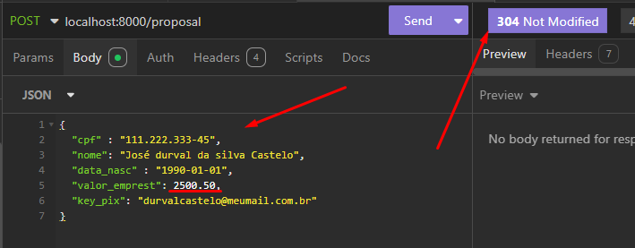
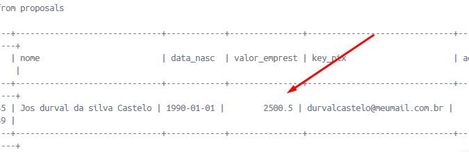
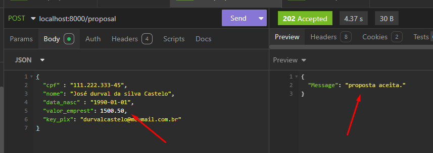

# 🏦 Teste Bankerize

Este projeto é uma micro API RESTful desenvolvida com Laravel para o cadastro de propostas de empréstimo, utilizando PHP 8.2, Docker e MySQL. O principal objetivo é garantir **100% de confiabilidade no cadastro da proposta**, mesmo em cenários onde APIs de terceiros estejam temporariamente indisponíveis.

---

## 🚀 Subindo o ambiente com Docker

### Pré-requisitos

- [Docker](https://www.docker.com/)
- [Docker Compose](https://docs.docker.com/compose/)
- Git (para clonar o repositório)

### Passos para iniciar o projeto

1. Clone este repositório:

```bash
git clone https://github.com/seu-usuario/teste-bankerize.git
cd teste-
```
### Lógica do Teste
Como a experiencia do usuario é imprescindivel, optamos por reaaliza o cadastro da proposta, independente da conexão com o parceiro, devolvendo mensagem de proposta ainda não aceita. quando a conexão é possivel, devolve a mensagem de proposta aceita e atualiza para executada.

#### imagens:




